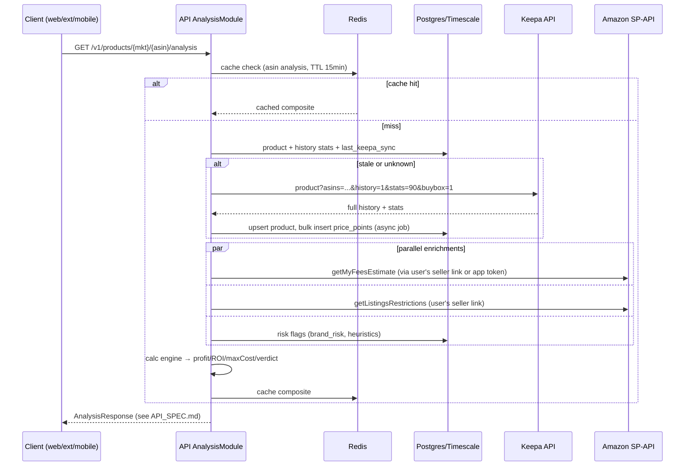
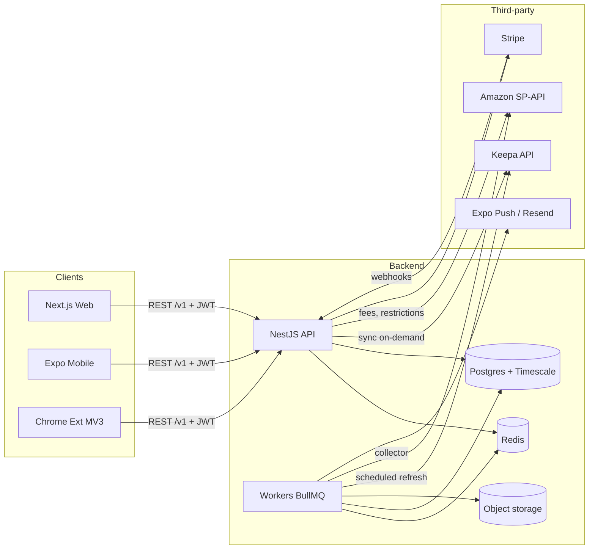

# ARCHITECTURE.md — SourceTool

## System shape: modular monolith + worker fleet
One NestJS codebase, two runtime entrypoints:
- **api** — HTTP REST (`apps/api/src/main.ts`), stateless, horizontally scalable.
- **worker** — BullMQ consumers (`apps/api/src/worker.ts`), runs ingestion, alert evaluation, exports, collector jobs.

No microservices. Rationale: single team, shared Prisma schema, sub-100k users for the foreseeable future; service boundaries are enforced as **NestJS modules with explicit exports**, so extraction later is mechanical if ever needed. This is the deliberate anti-overengineering call.

## Tech stack (with justifications)
| Layer | Choice | Why |
|---|---|---|
| Backend | **NestJS 10 + TypeScript** | Team stack; DI + module boundaries give monolith discipline |
| ORM | **Prisma** | Team stack; used for OLTP tables. Time-series tables use raw SQL via `$queryRaw` (Prisma can't express hypertable ops) |
| DB | **PostgreSQL 16 + TimescaleDB** | One database for OLTP + time-series. Hypertables + compression + continuous aggregates handle billions of price points. Alternative considered: ClickHouse — better at >10B rows but adds a second store, second failure mode, no FK joins to product metadata. Revisit only if p95 chart queries exceed 300ms at scale |
| Cache/queue | **Redis 7 + BullMQ** | Hot-ASIN analysis cache, rate-limit token buckets, job queues |
| Web | **Next.js 14 (App Router)** | SEO for public product pages (growth channel Keepa exploits well), RSC for data-heavy pages |
| Mobile | **React Native + Expo (dev client)** | Locked decision. Shares `packages/shared` + `packages/calc` + `packages/api-client` with web. `expo-camera` barcode scanning; VisionCamera if scan perf demands it |
| Extension | **Chrome MV3, React + Vite (CRXJS)** | Content scripts inject an iframe app served from our domain, reusing web panel components (see FRONTEND_WEB.md) |
| Charts | **uPlot** (price history) + **Recharts** (simple charts) | uPlot renders 10-year multi-series step charts in <10ms, ~45KB; Recharts too slow for Keepa-scale series. See FRONTEND_WEB.md |
| Auth | JWT access (15min) + rotating refresh (30d), argon2id | Standard; mobile/extension friendly |
| Payments | Stripe (subscriptions + metered usage) | |
| Infra | Docker; deploy to Railway/Fly/AWS ECS (pick at Phase 1); S3-compatible object storage for exports | |
| Monorepo | **pnpm + Turborepo** | Shared TS packages across 4 apps |

## Monorepo layout
```
sourcetool/
├── apps/
│   ├── api/          # NestJS (api + worker entrypoints)
│   ├── web/          # Next.js
│   ├── mobile/       # Expo RN
│   └── extension/    # Chrome MV3
├── packages/
│   ├── shared/       # Zod schemas, DTO types, enums (PriceSeries, Marketplace), constants
│   ├── calc/         # Pure profit/fee calculator engine — zero deps, runs on all 4 surfaces
│   ├── api-client/   # Typed fetch client generated from Zod schemas; used by web/mobile/extension
│   └── config/       # eslint, tsconfig, prettier presets
├── docs/             # these files
└── turbo.json, pnpm-workspace.yaml
```
Rule: `packages/*` never import from `apps/*`. `calc` and `shared` are pure (no IO) so the extension and mobile can compute verdicts offline from cached data.

## NestJS module map (service boundaries)
```
AuthModule          users, sessions, refresh rotation
BillingModule       Stripe, plans, usage metering (lookup quota)
SellerLinkModule    SP-API LWA OAuth, seller_accounts, token refresh
ProductModule       product metadata, variations, categories
HistoryModule       time-series read API (chart data, stats) — owns hypertables
AnalysisModule      composite "analyze ASIN" orchestrator (the core endpoint)
CalcModule          thin wrapper exposing packages/calc + fee lookups
EligibilityModule   SP-API Listings Restrictions per seller_account
RiskModule          brand_risk DB (IP complaints), hazmat/meltable/PL heuristics
OffersModule        live offers, buy-box events, seller stock
FinderModule        Product Finder query engine (Phase 2)
TrackerModule       trackers, alert evaluation, notifications
ListModule          sourcing lists, notes, tags, exports
SellerModule        seller lookup, storefronts (Phase 3)
IngestModule        Keepa client, token budget, import mappers
CollectorModule     own SP-API/scrape collectors, refresh scheduler
NotifyModule        email (Resend), push (Expo Push), webhooks
```
Boundary rule: modules touch other modules' data ONLY via exported services, never via Prisma queries against foreign tables. `IngestModule` and `CollectorModule` are the only writers to time-series tables.

## Data strategy (the big fork) — DECIDED: hybrid
**Options weighed:**
1. *Keepa-only*: fastest launch; permanent COGS + vendor risk; forbidden to bulk-mirror their DB (licensing), so Finder over full catalog stays token-expensive.
2. *Own-pipeline-only*: no dependency; but zero history at launch — charts are the product, so this is DOA competitively.
3. **Hybrid (chosen)**: Keepa API for on-demand history + stats; own collector records everything we ever fetch and independently refreshes tracked ASINs via SP-API + targeted crawling. Keepa dependency shrinks as our corpus ages.

**Hybrid mechanics:**
- First user lookup of an ASIN → Keepa `product` call (history=1, stats, buybox) → normalize → **persist full history into our hypertables** → serve. Cost ~1–5 tokens.
- Subsequent lookups → serve from our DB; call Keepa `update` only if `last_keepa_sync` older than freshness policy (hot ASIN: 1h; warm: 24h; cold: 7d).
- CollectorModule refreshes every ASIN in any user list/tracker on schedule using **SP-API** (Catalog Items = rank/attributes, Product Pricing = offers/buy box, Product Fees = fees) — official, free, rate-limited per seller token. From that point forward, those series are self-sourced.
- `price_points.source` column (0=keepa, 1=collector, 2=extension) preserves provenance; if Keepa contract ever ends, we keep operating on collected data + SP-API.
- **Keepa token budget**: IngestModule owns a Redis token-bucket mirror of our Keepa plan (refill rate from `/token` endpoint). Jobs declare token cost; over-budget requests queue rather than 429 upstream. Alert at 80% sustained burn → tier upgrade signal.

## Request flow — core analysis (Mermaid)


## System context (Mermaid)


## Worker jobs (BullMQ queues)
| Queue | Job | Schedule/trigger |
|---|---|---|
| `ingest` | persist-keepa-history | after each Keepa fetch (async, keeps analysis fast) |
| `collect` | refresh-asin (SP-API pricing+rank) | cron per freshness tier; fan-out over tracked ASINs |
| `collect` | refresh-fees | weekly per tracked ASIN |
| `alerts` | evaluate-trackers | every 5 min over ASINs with fresh data (event-driven: fires on new price_point insert for tracked ASINs) |
| `alerts` | deliver-notification | on alert match; email/push/webhook |
| `export` | build-csv / sheets-push | user-triggered |
| `finder` | run-saved-search | daily (Phase 3 watchlists) |
| `risk` | sync-ip-complaints | daily import job |

## Rate limiting & quotas
- Per-user API rate limit: Redis sliding window (60 req/min default; extension search-page bursts allowed to 120).
- **Lookup metering** (billing): one "lookup" = analysis of a distinct ASIN per rolling hour. Decrement plan quota in Redis, reconcile to Postgres hourly. Mirrors SellerAmp's model (entry tier 1,000/mo, upper tiers unlimited).
- Keepa budget: see Data strategy. SP-API: per-endpoint token buckets honoring Amazon's published rates; per-seller-account isolation so one user's burst can't starve another.

## Security
- Argon2id password hashing; refresh-token rotation w/ reuse detection; device-scoped sessions (mirrors SellerAmp device limits per tier).
- SP-API LWA refresh tokens encrypted at rest (AES-256-GCM, key in KMS/env); never returned to clients.
- Extension talks only to our API (no direct Keepa/SP-API from clients). CORS locked to our origins + extension ID.
- Row-level ownership checks in services (every list/tracker/profile query scoped by userId); no multi-tenant RLS complexity needed yet.
- PII surface is minimal: email, seller IDs. No Amazon buyer data — keeps SP-API data-protection-policy audit scope small.

## Observability
- Pino structured logs; OpenTelemetry traces on the analysis path (target p95 <1.5s warm); Sentry for API + all 3 clients; Grafana dashboards for Keepa token burn, collector lag, queue depth.

## Environments
`local` (docker-compose: pg+timescale, redis, mailhog) → `staging` → `prod`. Prisma migrations gate deploys. Seed script loads 50 known ASINs with synthetic history for dev without burning Keepa tokens.
